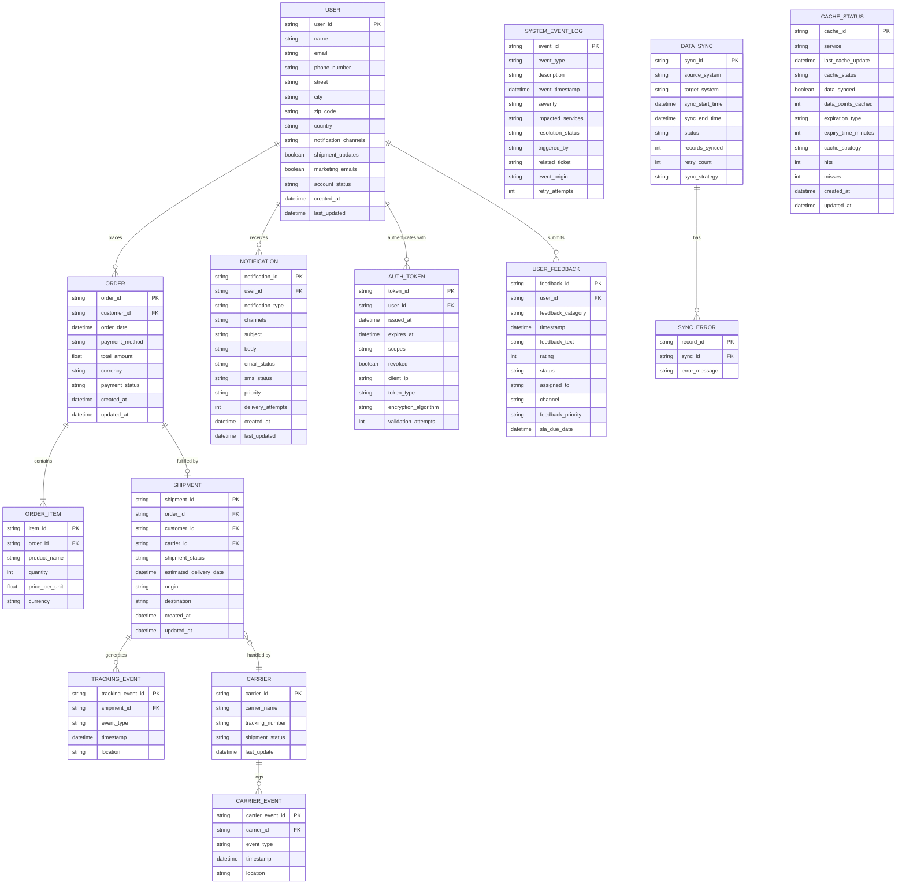

# ER Diagram Generation: JSON Data Samples

## Prompt Used in EPAM DIAL (GPT-4o)

> You are an expert Data Architect and Business Analyst.
>
> I am providing you with 10 JSON data samples from a shipment tracking and order management system. Analyze all JSON files and generate a single, comprehensive **Entity-Relationship (ER) diagram** in **Mermaid `erDiagram` syntax**.
>
> Requirements:
> 1. Identify all distinct **entities** across all JSON files (e.g., User, Order, Shipment, etc.).
> 2. For each entity, extract **relevant attributes** — include primary keys (PK) and foreign keys (FK). Omit pure technical/infrastructure fields (e.g., api_version, processing_time_ms) to keep the diagram business-focused.
> 3. Flatten nested objects into separate entities where the nesting represents a real sub-entity (e.g., `tracking_events[]`, `items[]`, `errors[]`).
> 4. Define **relationships** between entities using correct Mermaid cardinality notation (||, |{, o|, o{, etc.).
> 5. Use UPPER_SNAKE_CASE for entity names.
> 6. Add a short relationship label on each relationship line.
> 7. Output **only** valid Mermaid `erDiagram` code — no prose, no explanation.
>
> JSON files: [shipment_tracking.json, order_details.json, notification_payload.json, user_profile_data.json, auth_token_metadata.json, system_event_log.json, user_feedback.json, data_sync_status.json, carrier_tracking_data.json, cache_status.json]

---

## Outcome of Prompt Execution

### Entity Summary

| Entity | Source JSON | Description |
|---|---|---|
| `USER` | user_profile_data.json | Platform user with profile, address, and preferences |
| `ORDER` | order_details.json | Customer order with payment information |
| `ORDER_ITEM` | order_details.json → items[] | Individual line item within an order |
| `SHIPMENT` | shipment_tracking.json | Shipment linked to an order and a carrier |
| `TRACKING_EVENT` | shipment_tracking.json → tracking_events[] | Individual tracking event for a shipment |
| `CARRIER` | carrier_tracking_data.json | Carrier responsible for physical delivery |
| `CARRIER_EVENT` | carrier_tracking_data.json → events[] | Carrier-side event for a tracked shipment |
| `NOTIFICATION` | notification_payload.json | Notification sent to a user via one or more channels |
| `AUTH_TOKEN` | auth_token_metadata.json | Authentication token issued to a user session |
| `USER_FEEDBACK` | user_feedback.json | Feedback submitted by a user |
| `SYSTEM_EVENT_LOG` | system_event_log.json | System-level event or integration log entry |
| `DATA_SYNC` | data_sync_status.json | Record of a data synchronization run between systems |
| `SYNC_ERROR` | data_sync_status.json → errors[] | Individual error record within a sync run |
| `CACHE_STATUS` | cache_status.json | Cache state for a given service |

---

### Mermaid ER Diagram Code

---

## Relationship Summary

| Relationship | Cardinality | Description |
|---|---|---|
| USER → ORDER | One-to-Many | A user can place many orders |
| USER → NOTIFICATION | One-to-Many | A user can receive many notifications |
| USER → AUTH_TOKEN | One-to-Many | A user can have many active auth tokens |
| USER → USER_FEEDBACK | One-to-Many | A user can submit many feedback entries |
| ORDER → ORDER_ITEM | One-to-Many (mandatory) | Every order has one or more line items |
| ORDER → SHIPMENT | One-to-Zero-or-One | An order may have at most one associated shipment |
| SHIPMENT → CARRIER | Many-to-One | Many shipments can be handled by the same carrier |
| SHIPMENT → TRACKING_EVENT | One-to-Many | A shipment generates one or more tracking events |
| CARRIER → CARRIER_EVENT | One-to-Many | A carrier logs one or more delivery events |
| DATA_SYNC → SYNC_ERROR | One-to-Many | A sync run may produce zero or more errors |

> **Note:** `SYSTEM_EVENT_LOG` and `CACHE_STATUS` are standalone operational entities with no foreign-key relationships to the business domain — they represent infrastructure/audit concerns and are included as independent entities in the diagram.
