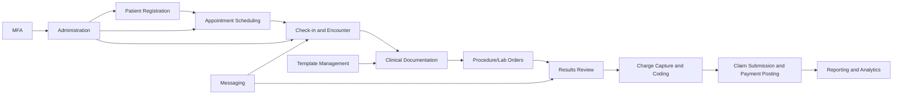

# Functional Documentation (AS-IS) — Healthcare EMR System

## 1. Scope
This document describes the **current (AS-IS)** functional behavior of a healthcare EMR platform (OpenEMR-style) from a reverse-engineering perspective.

Covered functional domains:
- Patient Management
- Scheduling
- Medical Records
- Procedure Management
- Billing
- Reporting
- Administration
- Messaging
- Multi-Factor Authentication (MFA)
- Template Management

---

## 2. Actors and Roles
- **Front Desk / Receptionist**: registration, appointments, insurance updates
- **Nurse / Medical Assistant**: intake, vitals, triage updates
- **Provider (Doctor/Clinician)**: encounters, diagnoses, procedures, orders
- **Billing Specialist**: coding, claim creation, payment posting
- **Administrator**: users, roles, system settings, security policies
- **Patient (via portal)**: appointments, secure messages, view records

---

## 3. Functionalities (AS-IS)

## 3.1 Patient Management
### UI elements
- Global patient search bar
- Patient demographics form (name, DOB, sex, address, contacts)
- Insurance panel
- Guarantor/emergency contact section
- Patient chart header with quick actions

### User flow
1. Staff opens patient search.
2. If patient exists, opens chart; otherwise selects **Create New Patient**.
3. Staff enters demographics and insurance details.
4. System validates required fields and checks duplicate candidates.
5. On save, patient record is created/updated and chart becomes available.

### Backend integration
- CRUD operations on patient master and insurance tables.
- Duplicate detection logic using demographics matching.
- Audit entries for create/update operations.
- Access controlled by role-based permissions.

---

## 3.2 Scheduling
### UI elements
- Calendar views (day/week/month)
- Provider/resource filters
- Appointment creation modal
- Status indicators (booked, checked-in, completed, canceled, no-show)

### User flow
1. Scheduler selects provider and date.
2. Creates appointment with patient, visit type, and duration.
3. System checks slot conflicts and resource availability.
4. Appointment is saved and appears in calendar.
5. On visit day, status is updated through check-in and completion.

### Backend integration
- Appointment records persisted in scheduling tables.
- Conflict detection queries on overlapping intervals.
- Status transition updates used by downstream billing/reporting.
- Optional reminder integration (SMS/email queue).

---

## 3.3 Medical Records
### UI elements
- Encounter list in patient chart
- Clinical note editor
- Vitals/labs/allergies/problem list widgets
- Medication and order entry panels
- Document upload/viewer

### User flow
1. Clinician opens patient chart and starts/opens encounter.
2. Records subjective/objective findings and updates vitals.
3. Adds diagnosis, medications, orders, and care plan.
4. Signs/finalizes encounter note.
5. Finalized data is visible in longitudinal patient history.

### Backend integration
- Encounter, observation, diagnosis, and medication entities persisted.
- Structured and unstructured clinical data storage.
- Document management integration for attachments.
- Immutable audit trail for signed notes.

---

## 3.4 Procedure Management
### UI elements
- Procedure catalog selector
- Order entry form
- Specimen/order tracking list
- Result entry/review panel

### User flow
1. Provider selects procedure/lab order during encounter.
2. System creates order with priority and instructions.
3. Order lifecycle progresses (ordered → collected → resulted).
4. Provider reviews results and acknowledges.
5. Relevant findings are attached to encounter/patient history.

### Backend integration
- Procedure/order tables linked to encounter and patient.
- Result payload ingestion from external lab interfaces (if configured).
- Status engine for order lifecycle transitions.
- Notification triggers for critical results.

---

## 3.5 Billing
### UI elements
- Charge capture screen
- Coding panel (ICD/CPT/HCPCS)
- Claim work queue
- Payment posting and invoice views

### User flow
1. Encounter completion generates billable items.
2. Billing user reviews codes/modifiers and validates claim readiness.
3. Claim is generated and submitted to clearinghouse/payer workflow.
4. Payments/adjustments are posted when remittance is received.
5. Account balance and statements are updated.

### Backend integration
- Financial transactions stored in billing/claims tables.
- Charge-to-claim transformation logic.
- ERA/EOB processing updates AR balances.
- Billing actions linked back to encounter/procedure references.

---

## 3.6 Reporting
### UI elements
- Report catalog (clinical, operational, financial)
- Filter controls (date range, provider, facility)
- Export actions (CSV/PDF)
- Dashboard widgets/KPI cards

### User flow
1. User selects report type and filters.
2. System executes report query against transactional data.
3. Results render in tabular/chart form.
4. User exports or schedules report distribution.

### Backend integration
- Predefined SQL/report definitions.
- Aggregation pipelines for KPIs.
- Role-based report access.
- Export service for file generation.

---

## 3.7 Administration
### UI elements
- User and role management screens
- Facility/practice configuration
- Code sets and lookup maintenance pages
- Security policy settings

### User flow
1. Admin creates users and assigns roles/privileges.
2. Admin configures facility, provider metadata, and system defaults.
3. Changes are saved and applied to runtime authorization.
4. Access and configuration changes are audited.

### Backend integration
- User, role, ACL/permission tables.
- Configuration store (system settings).
- Session and policy enforcement middleware.
- Admin activity audit logs.

---

## 3.8 Messaging
### UI elements
- Internal inbox/outbox
- Conversation/thread view
- Patient portal secure messaging panel
- Notification badges

### User flow
1. User composes message to internal staff or patient.
2. System routes message to target inbox.
3. Recipient reads/replies; thread state updates.
4. Message history remains attached to communication records.

### Backend integration
- Message/thread persistence.
- Access checks for provider-patient visibility boundaries.
- Optional email/SMS notification bridge.
- Retention policy for communication data.

---

## 3.9 MFA (Multi-Factor Authentication)
### UI elements
- Security settings page
- MFA enrollment wizard (QR/TOTP or OTP channel)
- Secondary code verification prompt at login

### User flow
1. User enrolls MFA method from profile/security settings.
2. At authentication, user enters username/password.
3. System prompts for second factor.
4. On success, session is established with elevated trust.

### Backend integration
- MFA secret/token storage (encrypted).
- Authentication pipeline with second-step verification.
- Recovery codes and fallback policy handling.
- Security logging for failed/suspicious attempts.

---

## 3.10 Template Management
### UI elements
- Clinical templates library
- Template editor (SOAP/encounter macros)
- Version/history panel
- Role/facility visibility controls

### User flow
1. Admin/clinician creates or edits documentation template.
2. Template is saved, versioned, and published.
3. Provider applies template in encounter note.
4. Auto-filled sections are adjusted and finalized.

### Backend integration
- Template and template-version entities.
- Access scope by role/facility/specialty.
- Rendering engine injecting template content into encounter notes.
- Change history for traceability.

---

## 4. Cross-Functional User Journey (AS-IS)
1. Patient is registered (Patient Management).
2. Appointment is booked (Scheduling).
3. Encounter is documented (Medical Records).
4. Procedures/labs are ordered and resulted (Procedure Management).
5. Charges and claims are processed (Billing).
6. Operational and financial outputs are reviewed (Reporting).
7. Secure communications and authentication controls are applied (Messaging + MFA).
8. Standardized notes are maintained (Template Management).

---

## 5. AS-IS End-to-End Diagram (Mermaid)

---

## 6. Non-Functional/Operational Observations
- Role-based access governs module visibility and actions.
- Audit logging is expected for clinical and administrative changes.
- Data integrity depends on encounter-centered linking across modules.
- Messaging and MFA are security-critical controls for compliance.

---

## 7. Conclusion
This AS-IS documentation captures the core healthcare EMR functionalities requested for reverse engineering and describes, for each module, the **UI elements**, **user flow**, and **backend integration**. It is structured for direct submission in Markdown format.
