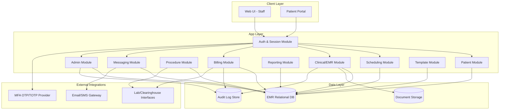
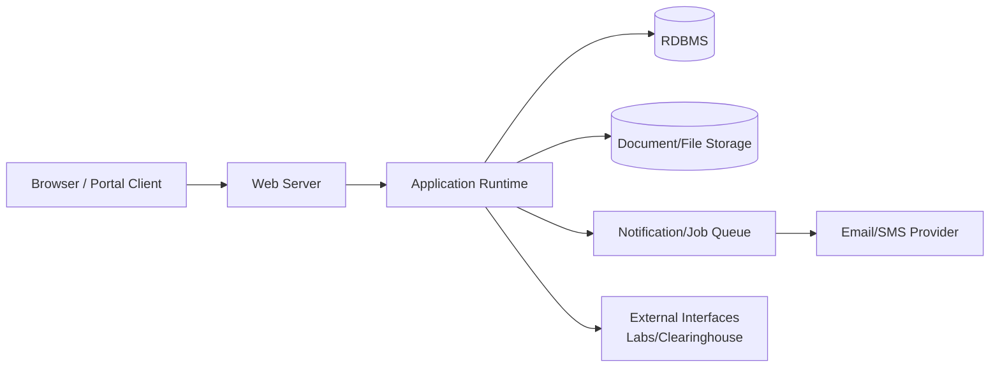
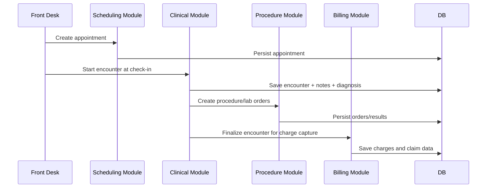
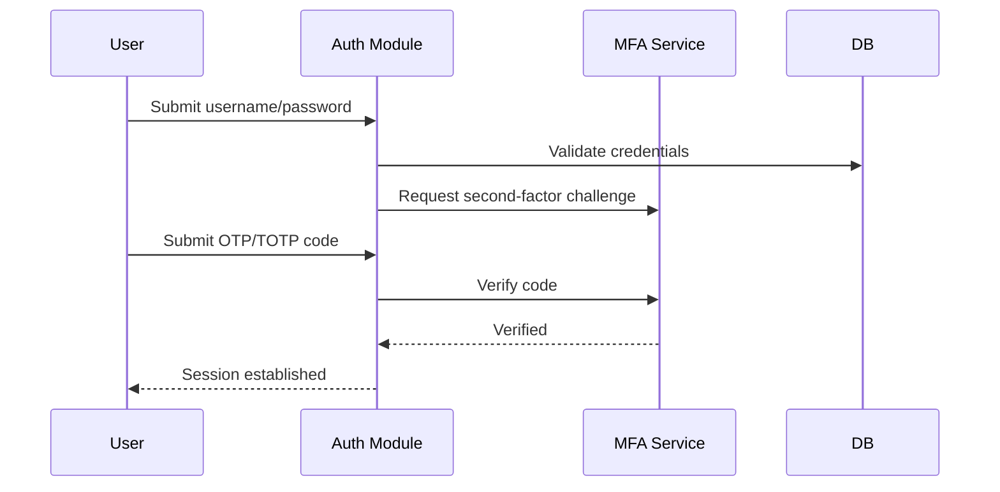
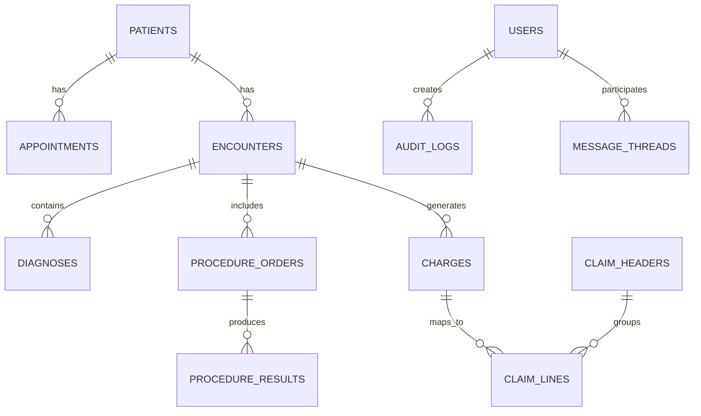

# Technical Documentation (AS-IS) — Healthcare EMR System

## 1. Purpose
This document provides **AS-IS technical documentation** for a healthcare EMR platform (OpenEMR-style), including:
- Low-Level Design (LLD)
- Architecture diagrams
- Module/component interactions
- Data model overview
- Security and integration patterns

---

## 2. System Context
The platform supports clinical and administrative operations across:
- Patient Management
- Scheduling
- Medical Records
- Procedure Management
- Billing
- Reporting
- Administration
- Messaging
- MFA
- Template Management

Primary users: front desk, clinicians, billing staff, admins, and patients (portal).

---

## 3. AS-IS Architecture (Logical)



---

## 4. Deployment View (AS-IS)



Notes:
- Session-based web application model.
- Core business logic centralized in application runtime.
- Relational DB is the source of truth for operational transactions.

---

## 5. Low-Level Design (Module Breakdown)

## 5.1 Authentication and MFA
### Responsibilities
- Primary credential verification
- Session/token issuance
- MFA challenge/verification
- Password policy and lockout handling

### Key components
- `AuthController`
- `SessionManager`
- `MfaService`
- `UserPolicyValidator`

### Data entities
- `users`
- `user_roles`
- `mfa_secrets`
- `login_attempts`

---

## 5.2 Patient Management
### Responsibilities
- Patient registration and updates
- Demographics and insurance maintenance
- Duplicate detection

### Key components
- `PatientController`
- `PatientService`
- `InsuranceService`
- `PatientRepository`

### Data entities
- `patients`
- `patient_contacts`
- `patient_insurance`
- `guarantors`

---

## 5.3 Scheduling
### Responsibilities
- Calendar and slot management
- Appointment lifecycle management
- Provider/resource conflict detection

### Key components
- `SchedulingController`
- `CalendarService`
- `ConflictEngine`
- `AppointmentRepository`

### Data entities
- `appointments`
- `appointment_status_history`
- `providers`
- `resources`

---

## 5.4 Medical Records (Clinical)
### Responsibilities
- Encounter creation and documentation
- Diagnoses, medications, vitals, and notes
- Document attachments and signing workflow

### Key components
- `EncounterController`
- `ClinicalNoteService`
- `ObservationService`
- `DocumentService`

### Data entities
- `encounters`
- `diagnoses`
- `medications`
- `observations`
- `clinical_documents`

---

## 5.5 Procedure Management
### Responsibilities
- Procedure/lab order placement
- Order status tracking
- Result ingestion and review

### Key components
- `ProcedureController`
- `OrderService`
- `ResultIngestionService`
- `OrderStatusEngine`

### Data entities
- `procedure_orders`
- `procedure_results`
- `specimens`

---

## 5.6 Billing
### Responsibilities
- Charge capture
- Coding and claim generation
- Payment posting and AR updates

### Key components
- `BillingController`
- `ChargeCaptureService`
- `ClaimService`
- `PaymentPostingService`

### Data entities
- `charges`
- `claim_headers`
- `claim_lines`
- `payments`
- `adjustments`

---

## 5.7 Reporting
### Responsibilities
- Operational/clinical/financial reports
- KPI aggregations
- Export and scheduled distribution

### Key components
- `ReportingController`
- `QueryTemplateEngine`
- `AggregationService`
- `ExportService`

### Data entities
- Derived from transactional tables
- `report_definitions`
- `report_runs`

---

## 5.8 Administration
### Responsibilities
- User/role/permission administration
- Facility/system configuration
- Security policy management

### Key components
- `AdminController`
- `RoleService`
- `SettingsService`
- `AuditService`

### Data entities
- `roles`
- `permissions`
- `role_permission_map`
- `system_settings`
- `audit_logs`

---

## 5.9 Messaging
### Responsibilities
- Internal and patient secure messaging
- Thread management
- Notification dispatching

### Key components
- `MessageController`
- `ThreadService`
- `NotificationService`

### Data entities
- `message_threads`
- `messages`
- `message_recipients`

---

## 5.10 Template Management
### Responsibilities
- Clinical template authoring and versioning
- Template rendering in encounter workflow

### Key components
- `TemplateController`
- `TemplateService`
- `TemplateRenderEngine`

### Data entities
- `templates`
- `template_versions`
- `template_scope_map`

---

## 6. Key Runtime Flows (Sequence Diagrams)

## 6.1 Appointment to Billing Flow



## 6.2 Login with MFA



---

## 7. Data Model Relationships (High Level)



---

## 8. API Surface (Representative)

### Authentication
- `POST /auth/login`
- `POST /auth/mfa/verify`
- `POST /auth/logout`

### Patient & Scheduling
- `GET /patients/search`
- `POST /patients`
- `PUT /patients/{id}`
- `POST /appointments`
- `PATCH /appointments/{id}/status`

### Clinical & Procedures
- `POST /encounters`
- `POST /encounters/{id}/sign`
- `POST /procedures/orders`
- `POST /procedures/results`

### Billing & Reporting
- `POST /billing/charges`
- `POST /billing/claims`
- `POST /billing/payments`
- `GET /reports/{reportId}`

### Messaging & Templates
- `POST /messages`
- `GET /messages/threads/{id}`
- `POST /templates`
- `POST /templates/{id}/publish`

---

## 8.1 Core Libraries and Technical Building Blocks (AS-IS)

### Backend framework and runtime
- HTTP server framework (e.g., Express/Spring-equivalent in deployment stack)
- ORM/DB access layer for relational persistence
- Validation library layer for request and domain validation
- Authentication/session middleware

### Security and identity
- Password hashing library (bcrypt/argon2 class)
- JWT/session token library (if token-based endpoints are enabled)
- TOTP/OTP library for MFA enrollment and verification
- Cryptography helper for secret/key encryption at rest

### Messaging and background processing
- Queue/job processor for asynchronous notifications
- SMTP/SMS provider SDKs for outbound communication
- Retry/backoff utility for transient integration failures

### Reporting and export
- Query/report generation engine
- CSV/PDF export libraries
- Scheduler/cron utility for periodic report execution

### Observability
- Structured logging library
- Metrics/tracing integration hooks
- Audit event publisher/store adapter

---

## 8.2 FHIR API Details and Mapping (AS-IS Interoperability)

### Supported interoperability intent
The platform can expose and/or integrate healthcare data using HL7 FHIR resource mapping patterns.

### FHIR resource alignment
- Patient Management → `Patient`, `RelatedPerson`, `Coverage`
- Scheduling → `Appointment`, `Schedule`, `Slot`, `Practitioner`
- Medical Records → `Encounter`, `Observation`, `Condition`, `MedicationRequest`, `DocumentReference`
- Procedure Management → `ServiceRequest`, `Procedure`, `DiagnosticReport`, `Specimen`
- Billing → `Claim`, `ClaimResponse`, `Invoice`, `PaymentNotice`, `PaymentReconciliation`
- Messaging → `Communication`, `CommunicationRequest`

### Representative FHIR-style endpoints
- `GET /fhir/Patient/{id}`
- `POST /fhir/Patient`
- `GET /fhir/Appointment?date=...&practitioner=...`
- `POST /fhir/Encounter`
- `POST /fhir/ServiceRequest`
- `GET /fhir/DiagnosticReport/{id}`
- `POST /fhir/Claim`
- `POST /fhir/Communication`

### Translation layer behavior
1. Internal request enters API gateway/controller.
2. Mapper converts internal DTO/entity to FHIR resource schema.
3. FHIR profile/rule validation is applied.
4. Resource persisted or forwarded to external HIE/partner endpoint.
5. Response is returned as FHIR JSON payload.

### Example mapping (internal to FHIR)
- Internal `patients.first_name` + `patients.last_name` → `Patient.name[0].given/family`
- Internal `appointments.start_time` → `Appointment.start`
- Internal `diagnoses.icd10_code` → `Condition.code.coding.code`
- Internal `procedure_results.report_text` → `DiagnosticReport.conclusion`

---

## 9. Security and Compliance Controls (AS-IS)
- Role-based access control (module- and action-level)
- MFA for protected user accounts
- Session timeout and re-authentication for sensitive actions
- Audit logging for clinical and administrative updates
- Secure messaging boundaries for patient-provider communication

---

## 10. Error Handling and Observability
- Standardized error responses (`4xx`, `5xx`)
- Validation failures returned with field-level error details
- Audit trail for critical transactions (encounters, claims, role changes)
- Operational logs for login failures, integration failures, and queue retries

---

## 11. Constraints and Technical Debt (Observed AS-IS)
- Tight coupling between clinical and billing event timing
- Reporting can be read-heavy on transactional DB during peak usage
- Integration reliability depends on external endpoint availability
- Template governance/version ownership may vary by facility

---

## 12. Coding Logic by Functionality (Pseudocode, AS-IS)

## 12.1 Patient Management
```text
function upsertPatient(payload, actor):
  authorize(actor, "PATIENT_WRITE")
  validateRequired(payload.demographics)
  candidates = findPossibleDuplicates(payload.demographics)
  if candidates and not payload.overrideDuplicate:
    return duplicateWarning(candidates)
  patientId = savePatientMaster(payload)
  saveInsurance(patientId, payload.insurance)
  writeAudit("PATIENT_UPSERT", actor, patientId)
  return success(patientId)
```

## 12.2 Scheduling
```text
function createAppointment(request, actor):
  authorize(actor, "SCHEDULE_WRITE")
  validateSlotInput(request.providerId, request.start, request.end)
  if hasConflict(request.providerId, request.start, request.end):
    return error("TIME_SLOT_CONFLICT")
  apptId = insertAppointment(request)
  enqueueReminder(apptId)
  writeAudit("APPOINTMENT_CREATED", actor, apptId)
  return success(apptId)
```

## 12.3 Medical Records
```text
function finalizeEncounter(encounterDraft, actor):
  authorize(actor, "ENCOUNTER_SIGN")
  validateClinicalContent(encounterDraft)
  encounterId = persistEncounter(encounterDraft)
  persistDiagnoses(encounterId, encounterDraft.diagnoses)
  persistObservations(encounterId, encounterDraft.observations)
  signEncounter(encounterId, actor.signature)
  writeAudit("ENCOUNTER_SIGNED", actor, encounterId)
  return success(encounterId)
```

## 12.4 Procedure Management
```text
function placeProcedureOrder(orderInput, actor):
  authorize(actor, "PROCEDURE_ORDER")
  validateOrder(orderInput)
  orderId = saveProcedureOrder(orderInput)
  sendToExternalLabIfConfigured(orderId)
  updateOrderStatus(orderId, "ORDERED")
  writeAudit("PROCEDURE_ORDERED", actor, orderId)
  return success(orderId)
```

## 12.5 Billing
```text
function generateClaim(encounterId, actor):
  authorize(actor, "BILLING_WRITE")
  charges = deriveChargesFromEncounter(encounterId)
  codedLines = applyCodingRules(charges)
  claimId = createClaim(codedLines)
  submitClaim(claimId)
  writeAudit("CLAIM_SUBMITTED", actor, claimId)
  return success(claimId)
```

## 12.6 Reporting
```text
function runReport(reportId, filters, actor):
  authorize(actor, "REPORT_VIEW")
  reportDef = loadReportDefinition(reportId)
  sql = bindFilters(reportDef.queryTemplate, filters)
  dataset = executeQuery(sql)
  file = exportIfRequested(dataset, filters.exportFormat)
  writeAudit("REPORT_RUN", actor, reportId)
  return success(dataset, file)
```

## 12.7 Administration
```text
function assignRole(userId, roleId, actor):
  authorize(actor, "ADMIN_RBAC")
  validateRoleAssignment(userId, roleId)
  upsertUserRole(userId, roleId)
  invalidateUserSessions(userId)
  writeAudit("ROLE_ASSIGNED", actor, userId)
  return success(userId)
```

## 12.8 Messaging
```text
function sendSecureMessage(threadInput, actor):
  authorize(actor, "MESSAGE_SEND")
  validateRecipients(threadInput.recipients)
  enforceVisibilityRules(actor, threadInput.patientId)
  msgId = persistMessage(threadInput)
  dispatchNotifications(msgId)
  writeAudit("MESSAGE_SENT", actor, msgId)
  return success(msgId)
```

## 12.9 MFA
```text
function verifyLoginWithMfa(credentials, otp, context):
  user = verifyPrimaryCredentials(credentials)
  if not user:
    recordFailedLogin(context)
    return deny()
  if user.mfaEnabled:
    if not verifyOtp(user.mfaSecret, otp):
      recordFailedMfa(user.id, context)
      return deny()
  session = issueSession(user.id, context)
  writeAudit("LOGIN_SUCCESS", user.id, session.id)
  return allow(session)
```

## 12.10 Template Management
```text
function publishTemplate(templateDraft, actor):
  authorize(actor, "TEMPLATE_PUBLISH")
  validateTemplateStructure(templateDraft)
  versionId = createTemplateVersion(templateDraft)
  markVersionPublished(versionId)
  propagateToEncounterEditor(versionId)
  writeAudit("TEMPLATE_PUBLISHED", actor, versionId)
  return success(versionId)
```

---

## 13. Conclusion
This AS-IS technical documentation provides a low-level, architecture-first view of the healthcare EMR platform and now explicitly includes **core libraries**, **FHIR-oriented API integration details**, and **coding logic pseudocode for each major functionality** in Markdown format for submission.
