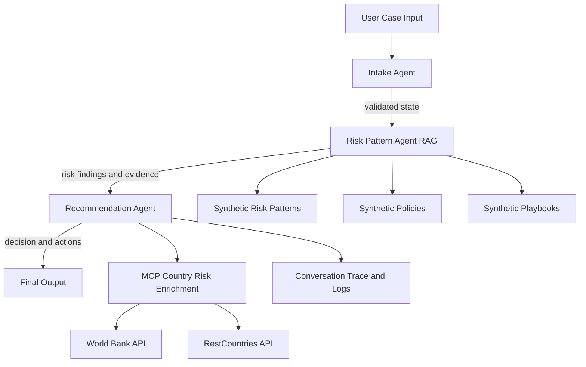
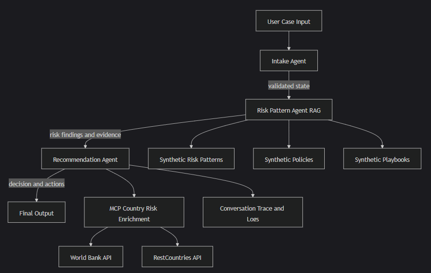

# Architecture Blueprint

## Project
Multi-Agent Financial Risk Investigation Assistant (Synthetic Data)

## Problem Statement
Risk and fraud analysts spend too much time manually combining transaction context, internal policy knowledge, and external country signals before deciding whether to approve, block, or escalate a case.

## System Goals
- Reduce triage time for suspicious transactions
- Improve consistency and explainability of first-line risk decisions
- Provide citation-backed recommendations with clear next actions
- Keep human-in-the-loop for final operational decisions

## Multi-Agent Architecture

### Agent 1: Intake Agent
Responsibilities:
- Validate case payload
- Check required fields and data quality
- Emit validation status and errors

Input:
- Raw case JSON

Output:
- Normalized case state
- intake_valid flag
- intake_errors list

### Agent 2: Risk Pattern Agent (RAG)
Responsibilities:
- Build retrieval query from case context
- Retrieve relevant synthetic fraud patterns, policies, and playbooks
- Produce structured risk findings and evidence citations

Input:
- Validated case state from Intake Agent

Output:
- risk_score and risk_category
- pattern_matches and policy_violations
- supporting evidence list

### Agent 3: Recommendation Agent
Responsibilities:
- Pull external MCP signals
- Combine RAG findings + MCP risk signals
- Produce final decision and action plan

Input:
- RAG findings
- MCP signals

Output:
- decision: approve/manual_review/block
- confidence and rationale
- next_actions

## Orchestration
Framework: LangGraph

Execution graph:
1. intake
2. rag
3. recommendation
4. end

State handoff is explicit and typed via graph_state.

## Architecture Diagram

## RAG Design
Corpus:
- Synthetic risk patterns
- Synthetic internal policies
- Synthetic investigation playbooks

Retrieval strategy:
- Hybrid local ranking (lexical overlap + sequence similarity + source/severity weighting)
- Candidate pool generation
- Optional Claude reranking over top candidates

Fallbacks:
- If Claude rerank is unavailable, deterministic local rank is used
- Evidence list is still produced for explainability

## MCP Integration
Mode:
- Configurable: mock or live external enrichment

Implemented external enrichment:
- OFAC SDN public list (sanctions lookup)
- World Bank country metadata API
- RestCountries metadata API
- open.er-api exchange-rate context
- Google News RSS risk-keyword scan (adverse-media approximation)

Usage:
- Entity sanctions screening and adverse-media signal extraction
- Country-level prior risk enrichment in Recommendation Agent
- External signals included in rationale and state

Note:
- Mock mode remains available for deterministic testing.
- Live mode uses public no-key endpoints and graceful fallback behavior.

## Data Flow
1. User submits case
2. Intake validates input
3. RAG retrieves and scores evidence
4. Recommendation agent enriches with MCP signals
5. Final decision and trace returned

## Observability
Collected per run:
- Agent action log (conversation_log)
- Risk findings
- MCP signals
- Final recommendation

Trace is shown in CLI output for demo clarity.

## Technology Stack
- Python 3.12
- LangGraph orchestration
- LangChain-compatible RAG design
- Anthropic Claude (reranking/rationale)
- Public HTTP APIs for MCP live enrichment

## Security and Privacy
- Synthetic data only
- No production banking data
- API secrets in local .env (gitignored)
- Deterministic fallback behavior if external tools fail

## Testing Strategy
- Positive scenarios: expected approve/block flows
- Negative/adversarial scenarios: invalid fields, malformed channels, high-risk combinations
- Regression suite validates end-to-end path
- RAG quality comparison validates rerank impact versus local-only ranking

Current status:
- 29/29 tests passing (25 main scenarios + 4 adversarial edge cases)
- All decision boundaries validated (approve: 12/12, manual_review: 5/5, block: 8/8)
- RAG comparison: top-1 changed in 7/20 cases, top-5 order changed in 20/20 cases
